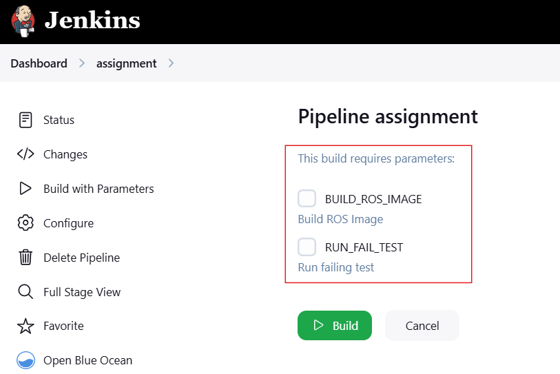

# Assignment

It runs a Gazebo simulation in Jenkins

## Jenkins Pipeline
The pipeline is located at https://jenkins-assignment1.arrc.tii.ae/job/assignment/

### Pipeline usage
- To run the pipeline click on `Build with Parameters`


- The pipeline has two parameters:
  1. `BUILD_ROS_IMAGE` - When it's checked, it builds the docker image. If it's unchecked it skips the Build ROS Image stage.
  2. `RUN_FAIL_TEST` - When it's unchecked, it runs the `pure_pursuit_sim.py` script, which finish with a succesful simulation. If it's checked it runs `error_sim.py`, which provoques a failed pipeline.



- The pipeline sends a notification email with the result.


## Pipeline Stages
The Jenkins pipeline consists of four stages:
- `Build ROS Image` - It builds the ROS and Gazebo Docker image and push it into https://hub.docker.com/r/asoteloa/assignment using [Kaniko](https://github.com/GoogleContainerTools/kaniko/). To change the push repository, you need to change the first line of the Jenkinsfile `def ROS_IMAGE = 'docker.io/asoteloa/assignment:latest'` and update the [credentials](https://jenkins-assignment1.arrc.tii.ae/manage/credentials/store/system/domain/_/credential/docker-registry-abraham-credentials/).
- `Run Simulator` - It runs the Gazebo simulator within the ROS image built in the previous stage. After launching the simulator, it waits for 20 seconds to move to the next stage: `Testing`, and keeps the simulator running until the `Testing` stage finishes.
- `Testing` - It runs physically in the same container than the previous stage: `Run Simulator`, It executes 250 steps of the simulation script and checks that the Crosstrack error doesn't exceed the value of 1.0, If the error exceeds 1.0, the stage will fail.
- `Post Actions` - It sends a notification email with the pipleine result. To change the receiver address, you need to specify the new address in the post stage of the Jenkinsfile. To change the sender address, you need to configure the `E-mail Notification` section in [Jenkins configuration](https://jenkins-assignment1.arrc.tii.ae/manage/configure) with the new information.


## Stack in Docker
To run the stack in Docker
1. Build and run the ROS and Gazebo Docker image executing the script:
 ``` bash
 ./build_docker.sh
 ```
A container named `steerai` will run.

2. With the container running, open a new shell and execute:
  ``` bash
  docker exec -it steerai bash ./scripts/sim_gui.sh
  ```

3. With the container running, open a new shell and execute:
  ``` bash
  docker exec -it steerai bash ./scripts/pure.sh
  ```


### The scripts folder
The scripts inside this folder are intended only for local development

- `sim_gui.sh`: It must to be executed in the container with ROS and Gazebo simulator. It launches the Gazebo simulator in GUI mode.
- `pure.sh`: It must be run in the same container that the simulator is running. It runs the simulator script `pure_pursuit_sim.py`
- `error.sh`: It must be run in the same container that the simulator is running. It runs `error_sim.py`, which is a modified version of `pure_pursuit_sim.py` with a speed of 24.0 in order to get a crosstrack error larger than 1.0

### The tests folder
Contains the test executed by the python unit testing framework `unittest`

